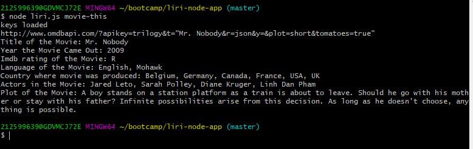

# liri-node-app
Liri Node App
LIRI is like iPhone's SIRI. However, while SIRI is a Speech Interpretation and Recognition Interface, LIRI is a _Language_ Interpretation and Recognition Interface. LIRI is a command line node app that takes in parameters and gives you back data.

# Pre-requisites
Before you start, you will need to do the following:
1. Download and install nodeJS from https://nodejs.org/en/download/ to run liri on terminal command line.
2. Download and install npm from https://www.npmjs.com/get-npm to help you get all the dependancies needed to run liri
3. On terminal, run the following command: npm install
4. Liri uses npm-spotify-api for spotify song search which inturn retrieves song information from the Spotify API. In order for this to work, you need to sign up as a Spotify developer to generate the necessary credentials from Spotify. You can follow these steps in order to generate a **client id** and **client secret**:
   * Step One: Visit <https://developer.spotify.com/my-applications/#!/>
   * Step Two: Either login to your existing Spotify account or create a new one (a free account is fine) and log in.
   * Step Three: Once logged in, navigate to <https://developer.spotify.com/my-applications/#!/applications/create> to register a new application to be used with the Spotify API. You can fill in whatever you'd like for these fields. When finished, click the "complete" button.
   * Step Four: On the next screen, scroll down to where you see your client id and client secret. Copy these values down and use them in the next step (step 5 below).
5. Create a file named `.env` with the following contents: 
        #### _Spotify API keys_
        #### _SPOTIFY_ID=your-spotify-id_
        #### _SPOTIFY_SECRET=your-spotify-secret_
    * Replace your-spotify-id and your-spotify-secret in the .env file with the Spotify client id and client secret retrieved during the previous step (no quotes).

# Usage
1. To search for concerts in town, type the following on terminal:
    `node liri.js concert-this '<artist/band name here>'`

* This will search the Bands in Town Artist Events API for the specified artist/band and render the following information to the terminal:

     * Name of the venue
     * Venue location

* The image below is an example of a commandline request and liri's response:

2. To search for information about songs in Spotify, type the following on terminal: 
    `node liri.js spotify-this-song '<song name here>'`

* This will show the following information about the specified song in your terminal/bash window

     * Artist(s)
     * The song's name
     * A preview link of the song from Spotify
     * The album that the song is from
   * If no song is provided then your program will default to "What's My Age Again" 

* The image below is an example of a commandline request with a song name and liri's response:

* The image below is an example of a commandline request without a song name and liri's response. Please note, liri will use a default song:

3. To search for information about a movie in OMDB, type the following on terminal:
    `node liri.js movie-this '<movie name here>'`

* This will output the following information to your terminal/bash window:
       * Title of the movie.
       * Year the movie came out.
       * IMDB Rating of the movie.
       * Rotten Tomatoes Rating of the movie.
       * Country where the movie was produced.
       * Language of the movie.
       * Plot of the movie.
       * Actors in the movie
   * If the user doesn't type a movie in, the program will output data for the movie 'Mr. Nobody.'

* The image below is an example of a commandline request with a movie name and liri's response:

* The image below is an example of a commandline request without a movie name and liri's response. Please note, liri will use a default movie:

4. You can also run commands from 2 (Spotify song search) and 3 (OMDB movie search)  from a text file by typing the following on terminal:
    `node liri.js do-what-it-says inputFileName`
    
* In order to make this work, you must have a file whose name is the same as inputFileName with one of the following 2 command types in it to perform music/movie search:
    * spotify-this-song,"I Want it That Way"
        OR
    * movie-this,"Some Like It Hot"

* The image below is an example of a commandline request to use a file for performing spotify song search and liri's response:

5. You can check log.txt for the requests you made on commandline and the information that liri returned to you. See image below for an example run:

